A partial implementation of [Dynamic Routing Between Capsules](https://arxiv.org/abs/1710.09829)  
Currently this repo contains only the experiments on MNIST/Multi-MNIST.
My experiment on Multi-MNIST wasn't successful; the reconstructed images were too blur.

The CapsuleNet has an amazingly simple architecture. In my opinion, they have at least 2 special features:
1. Iterative attention mechanism (they call it "dynamic routing).  
2. Vector representation of concepts/objects, with the magnitude representing the probibility of an object's existence.

# Dependency
Python 3.5  
Tensorflow 1.4  

# Usage
Run `python capsule.py` and use `tensorboard --logdir [logdir/train/datetime-Capsule]` to see the results.

To run the Multi-MNIST test, you need to first build the dataset by  
`python build_multimnist`  
and then run the experiment by  
`python train_multimnist.py`  

# Results 
Their figure showing the result of dimension pertubation.  
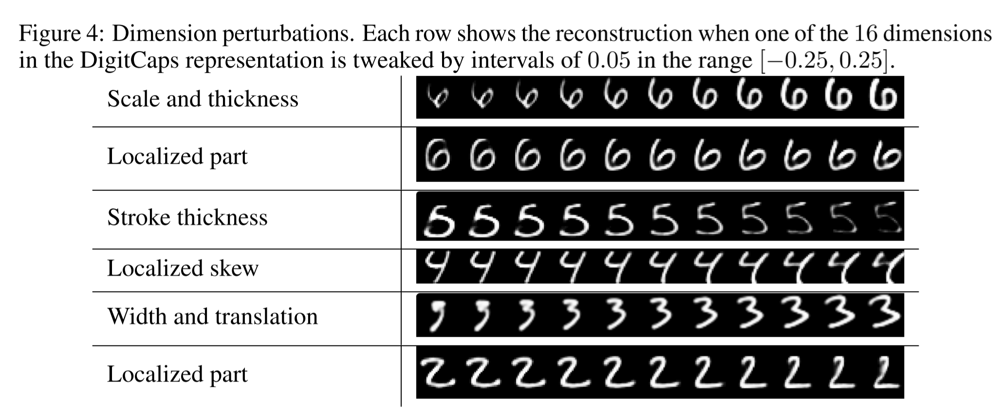  

 

Each column is a dimension of the Digit Capsule.  
Each row is a perturbation [-.25, 0.25] with 0.05 increment.  

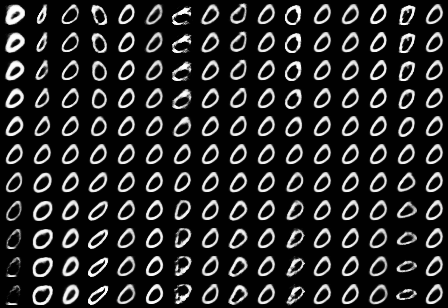
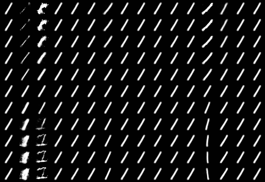
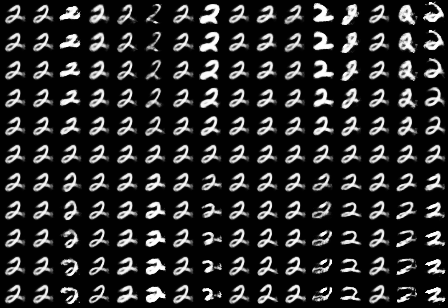
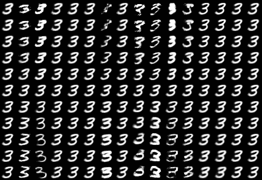
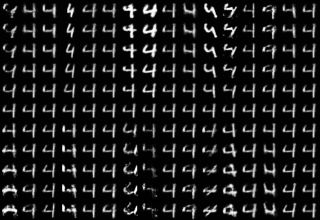
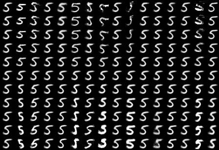
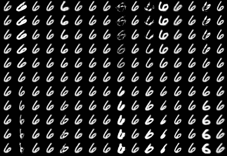
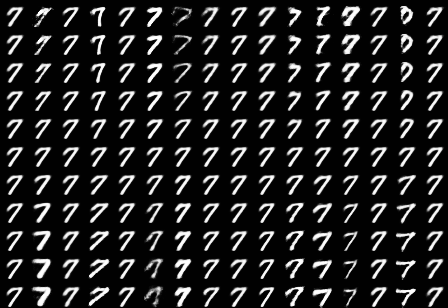
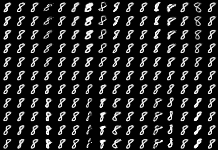
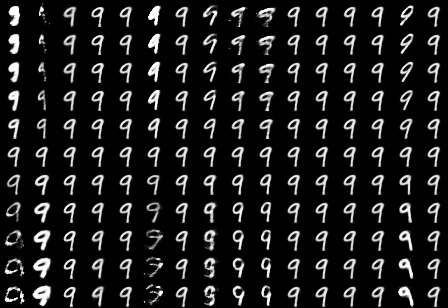  
Indeed, there are always some dimensions that represent orientation and thickness.

The image, reconstruction, and latent representation of an input of digit 8.  
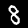
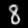
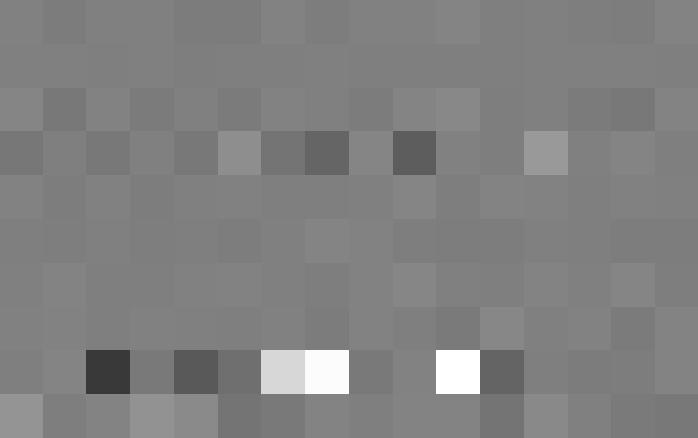  
The 8th row is highly activated, so the prediction is naturally 8 (note that the competing digit is 3 but the magnitude is apparently lower). In addition, the highly activated dimensions (7 & 8) represent thickness and orientation. (use `tensorboard` to view the results above.)  

# Difference
1. I rescaled the input to [-1, 1] and used `tanh` as the output non-linearity of the reconstruction net.  
2. Not all hyper-parameters were specified in their paper.
3. (Note that my Multi-MNIST failed).
3. In my Multi-MNIST implementation, I merge two images during runtime instead of precompute a 60M dataset. 
   This differed from the paper's method.
4. How "accuracy" is defined in Multi-MNIST is unclear to me. 
   Should it be an "unweighted recall" rate?
   Or should it be the "exact match" rate?
   I ended up adding both into the summary.
5. In my Multi-MNIST, the network seemed to loss its ability to infer from images with a single digit, 
   let alone to reconstruct it. This wasn't something that I expected.

# Discussion
1. Their experimental setting on Multi-MNIST isn't 100% reasonable in my opinion.
   They assumed a strongly supervised condition where the 2 original images were known, 
   which is less practical in real applications.
   Besides, this condition may allow us to do some other tricks during training...

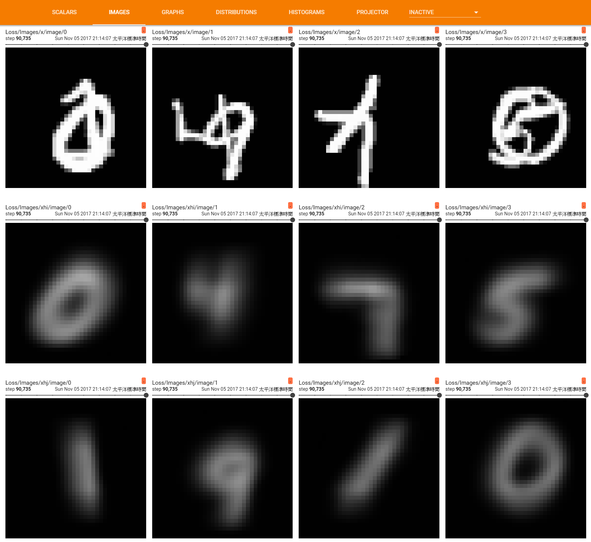 
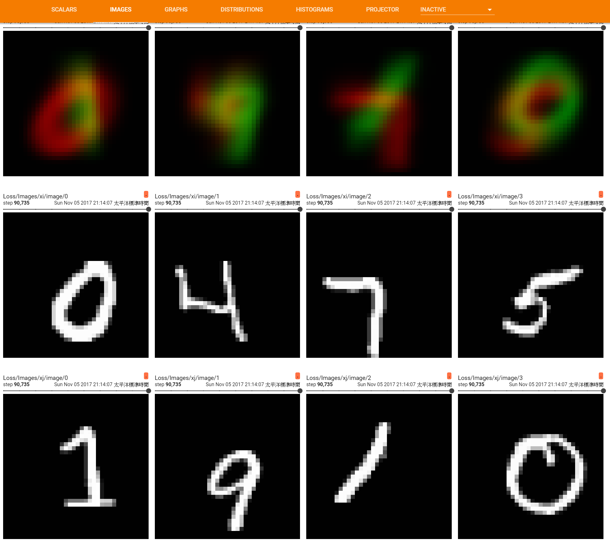